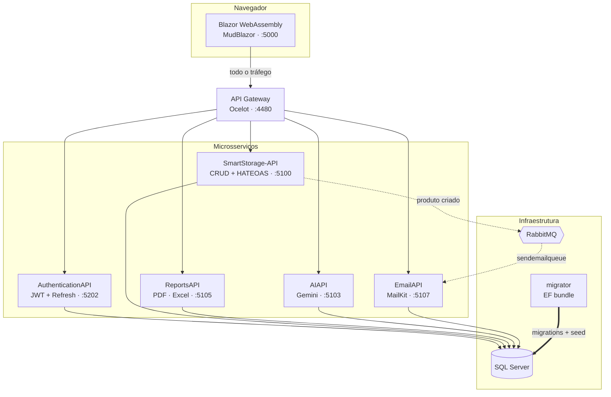

# SmartStorage

**Sistema de gestão de estoque construído como uma arquitetura de microsserviços em .NET, do banco de dados à interface, inteiramente containerizado.**


---

## Sobre o projeto

O SmartStorage controla o ciclo completo de um almoxarifado: cadastro de produtos e colaboradores, alocação de produtos em prateleiras, registro de vendas, relatórios gerenciais e análise de dados por IA.

O foco do projeto não é o domínio em si — é a **arquitetura**. Cada responsabilidade vive em um serviço próprio, com seu próprio ciclo de build e sua própria imagem Docker, coordenados por um API Gateway e por um broker de mensagens. É o tipo de estrutura que normalmente só se encontra em ambiente corporativo, construída aqui do zero para exercitar as decisões que ela exige.

| | |
|---|---|
| **7 serviços** de aplicação | **10 containers** orquestrados |
| **~16.000 linhas** de C# e Razor | **35 rotas** roteadas pelo gateway |
| **353 commits** desde abril de 2025 | **1 comando** para subir tudo |

---

## Arquitetura



O **gateway** é a única porta de entrada: o front não conhece o endereço de nenhum serviço, só o dele. São 35 rotas mapeadas no Ocelot — o CRUD completo do domínio mais autenticação, relatórios, IA e e-mail —, o que deixa CORS, roteamento e a superfície exposta ao navegador em um lugar só.

A comunicação entre serviços é assíncrona onde faz sentido: criar um produto publica um evento no **RabbitMQ**, e o envio de e-mail acontece fora do ciclo da requisição — o usuário não espera pelo SMTP.

---

## Módulos

### 🔐 AuthenticationAPI
Autenticação própria com **JWT + refresh token**: `signin`, `refresh`, `revoke`, CRUD de usuários e alteração de credenciais. Dois papéis (`Usuário` e `Administrador`) propagados como *claims* e verificados tanto nas APIs quanto na interface, que esconde ações restritas.

### 📦 SmartStorage-API
Núcleo do domínio — produtos, colaboradores, prateleiras e vendas. Organizado em camadas explícitas (`Business` → `Repository` → `Converter`), com **HATEOAS** implementado de verdade: cada recurso retorna os links das ações possíveis, montados por *enrichers* dedicados e injetados por um action filter.

### 📊 ReportsAPI
Geração de relatórios gerenciais em dois formatos:
- **Excel** via ClosedXML, com formatação monetária e colunas autoajustadas
- **PDF** via QuestPDF, incluindo **gráficos renderizados server-side** com ScottPlot (produtos mais vendidos do mês, total de vendas por período)

### 🤖 AIAPI
Integração com o **Google Gemini 2.5 Flash**. A interface expõe um chat onde o gestor faz perguntas em linguagem natural sobre as vendas; o serviço monta o contexto a partir dos dados reais do banco e devolve a análise. A chave da API nunca sai do servidor — o WebAssembly conversa apenas com o endpoint interno.

### ✉️ EmailAPI
Consumidor RabbitMQ rodando como `BackgroundService`, ouvindo a fila `sendemailqueue` e disparando notificações por MailKit.

### 🖥️ Blazor WebAssembly
SPA em **MudBlazor** com autenticação persistida em LocalStorage, `AuthenticationStateProvider` customizado lendo as claims do JWT, upload de imagens de produto, dashboard de insights e exportação de relatórios.

---

## Diferenciais técnicos

Os pontos abaixo são as decisões que considero mais representativas do projeto.

**HATEOAS de verdade, não só REST no nome.**
A maioria dos projetos para por CRUD sobre HTTP. Aqui há uma camada de hipermídia real: `ProductEnricher`, `SaleEnricher`, `ShelfEnricher` e afins enriquecem cada resposta com os links das transições disponíveis, aplicados por filtro global.

**Versionamento de API desde o início.**
Todas as rotas seguem `api/storage/[controller]/v{version}` via `Asp.Versioning`, permitindo evoluir contratos sem quebrar consumidores.

**Comunicação assíncrona onde importa.**
O cadastro de produto publica no RabbitMQ e retorna imediatamente. O envio de e-mail é problema de outro serviço, em outro processo, no seu próprio ritmo.

**Schema versionado e aplicado por um container dedicado.**
Em vez de rodar migrations pela aplicação — o que daria a cinco serviços permissão de DDL e criaria concorrência entre eles —, existe um serviço `migrator` que aplica e morre. Seu Dockerfile gera um **EF migrations bundle** autocontido no estágio de build, e a imagem final roda em `runtime-deps`: **sem SDK, sem `dotnet-ef`, apenas o binário**. Os serviços que usam o banco só sobem depois dele, via `service_completed_successfully` — se a migration falhar, o stack inteiro se recusa a subir em vez de correr contra um schema errado.

**Healthchecks que verificam o serviço, não o processo.**
"Container iniciou" e "serviço utilizável" são coisas diferentes, e ignorar isso gera bugs que só aparecem em máquina limpa. O RabbitMQ é checado por `check_port_connectivity`, porque o consumidor conecta durante o `Host.StartAsync`. E o SQL Server não é checado apenas por um `SELECT 1` no `master` — que responde enquanto o banco da aplicação ainda está em recuperação — mas por uma condição que exige nenhum banco de usuário fora do estado `ONLINE`.

**Imagens preparadas para produção.**
Todo serviço usa *multi-stage build* (`sdk` → `aspnet`), roda como usuário **não-root** e expõe 8080. O Blazor, por ser WebAssembly, termina em `nginx-unprivileged` servindo arquivos estáticos, com `try_files` para as rotas do SPA sobreviverem a um F5.

**Configuração por ambiente.**
As rotas do Ocelot e as origens de CORS trocam de valor via `appsettings.Docker.json`, ativado por `ASPNETCORE_ENVIRONMENT` — sem precisar sobrescrever dezenas de chaves aninhadas por variável de ambiente. Nenhuma credencial mora em `appsettings`: no Docker elas entram por variável de ambiente a partir de um `.env` fora do versionamento, e fora dele vêm dos *user secrets* de cada projeto — com a precedência montada para que o ambiente sempre vença o arquivo.

**Banco que nasce utilizável.**
O seed é declarado por `HasData` no `OnModelCreating`, então viaja junto com as migrations e é aplicado pelo mesmo `migrator` — sem passo manual e sem serviço extra. Um `docker compose up` em máquina limpa entrega um banco com usuário administrador e estoque de exemplo pronto para navegar.

---

## Como executar

**Pré-requisito:** Docker Desktop.

```bash
git clone https://github.com/LeoLiras/SmartStorage.Web.git
cd SmartStorage.Web
cp .env.example .env      # preencha as variáveis — o arquivo vem com os campos vazios
docker compose up -d
```

> A senha do SQL Server precisa satisfazer a política de senha forte: mínimo de 8 caracteres, com maiúscula, minúscula, número e símbolo. A `GOOGLE_API_KEY` é opcional — sem ela tudo funciona, exceto a análise por IA.

Cerca de 20 segundos depois, o sistema está no ar em **http://localhost:5000**.

| Acesso | |
|---|---|
| **Usuário** | `admin` |
| **Senha** | `admin123` |

O banco já sobe com colaboradores, prateleiras, produtos e suas alocações — dá para navegar por tudo sem cadastrar nada antes.

<details>
<summary><b>Rodando fora do Docker (Visual Studio / <code>dotnet run</code>)</b></summary>

Os `appsettings.json` não guardam credenciais. A connection string, o segredo do JWT e as credenciais de e-mail ficam em [user secrets](https://learn.microsoft.com/aspnet/core/security/app-secrets), fora do repositório, e cada projeto executável precisa dos seus:

```bash
cd SmartStorage-API
dotnet user-secrets set "ConnectionStrings:SqlServerConnection" "<sua connection string>" -p SmartStorage-API/SmartStorage.API.csproj
dotnet user-secrets set "TokenConfigurations:Secret" "<segredo do JWT>" -p SmartStorage-API/SmartStorage.API.csproj
```

O mesmo para `SmartStorage.AIAPI`, `SmartStorage.AuthenticationAPI` e `SmartStorage.ReportsAPI`. O `SmartStorage.EmailAPI` usa `TokenConfigurations:Secret`, `Email:Username`, `Email:Password` e `Email:Destinatario` (o endereço que recebe a notificação de novo produto). O segredo do JWT precisa ser **o mesmo em todos** — é ele que assina e valida os tokens.

No Docker nada disso é necessário: o compose injeta tudo por variável de ambiente a partir do `.env`.

</details>

<details>
<summary><b>Portas expostas</b></summary>

| Serviço | Porta |
|---|---|
| Blazor | 5000 |
| API Gateway | 4480 |
| SmartStorage-API | 5100 |
| AIAPI | 5103 |
| ReportsAPI | 5105 |
| EmailAPI | 5107 |
| AuthenticationAPI | 5202 |
| SQL Server | 1433 |
| RabbitMQ (management) | 15672 |

</details>

---

## Stack

| Camada | Tecnologias |
|---|---|
| **Backend** | .NET 10, ASP.NET Core, Asp.Versioning |
| **Frontend** | Blazor WebAssembly, MudBlazor, Blazored.LocalStorage |
| **Dados** | SQL Server 2022, Entity Framework Core |
| **Gateway** | Ocelot |
| **Mensageria** | RabbitMQ |
| **Autenticação** | JWT Bearer, refresh tokens, autorização por papel |
| **Relatórios** | QuestPDF, ClosedXML, ScottPlot |
| **IA** | Google Gemini 2.5 Flash |
| **E-mail** | MailKit |
| **Infra** | Docker, Docker Compose, nginx |
| **Documentação** | Swagger / OpenAPI |

---

## Estrutura

```
SmartStorage.Web/
├── docker-compose.yml              # orquestração dos 10 containers
├── .env.example                    # modelo das variáveis de ambiente
└── SmartStorage-API/
    ├── SmartStorage-API/           # API core (domínio + HATEOAS)
    ├── SmartStorage.APIGateway/    # Ocelot
    ├── SmartStorage.AuthenticationAPI/
    ├── SmartStorage.ReportsAPI/
    ├── SmartStorage.AIAPI/
    ├── SmartStorage.EmailAPI/
    ├── SmartStorage.Blazor/        # SPA WebAssembly
    ├── SmartStorage.Infraestructure/  # DbContext, migrations, seed
    ├── SmartStorage.Configurations/   # configuração compartilhada
    ├── SmartStorage.MessageBus/
    └── SmartStorage.Shared/        # modelos, VOs, hipermídia
```

---

## Autor

**Leonardo de Lira Siqueira**

[](https://github.com/LeoLiras)
